# Blog Sederhana Menggunakan CI 3

## Installasi
- Import Database `db_blog.sql` ke dalam `phpmyadmin`.
- Lalu buka browser dan ketik di url [http://localhost/blog](http://localhost/blog).

## Screenshot
- Landing page

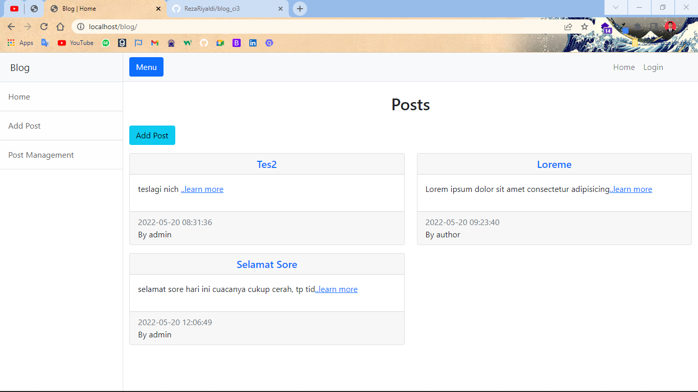

- Login

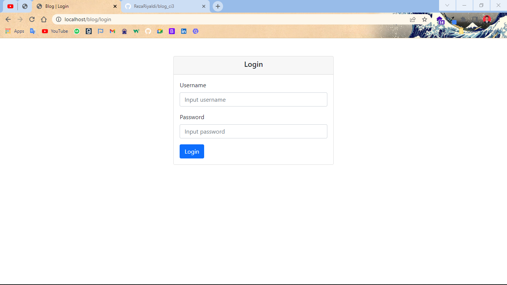

- Halaman Admin
  - username: `admin`
  - password: `admin`

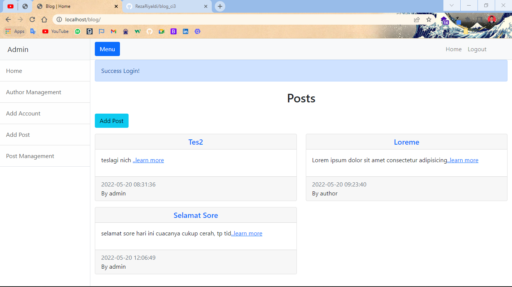

- Halaman Author
  > Terdapat perbedaan pada sidebar antara admin dan author.
  - username: `author`
  - password: `author`

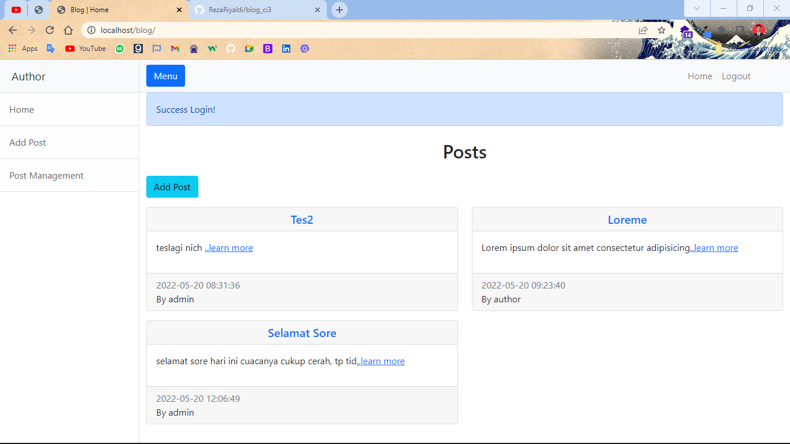

- Halaman Add Account

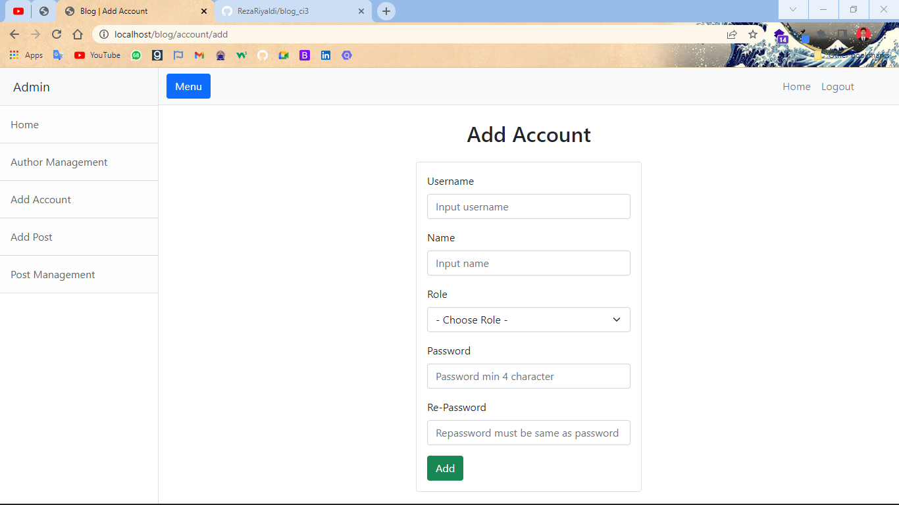

- Halaman Author Management
> Hanya account dengan role author yang terdapat pada halaman ini.

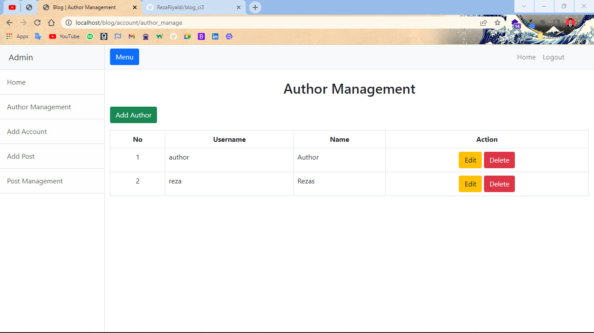

- Halaman Add Post

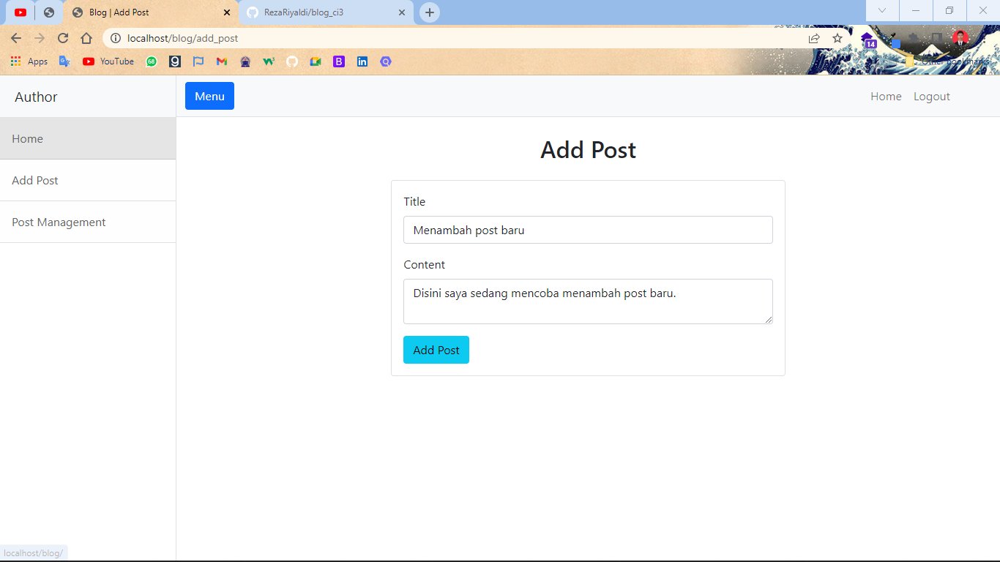
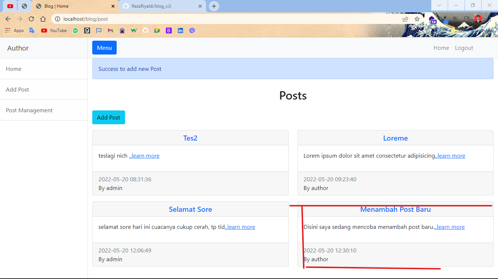

- Halaman Post Management

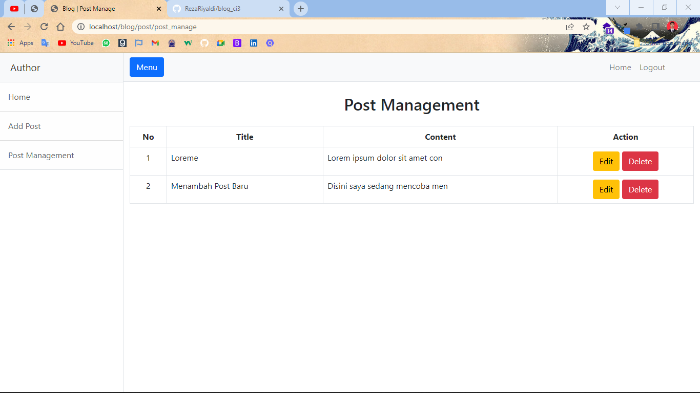

- Edit Post

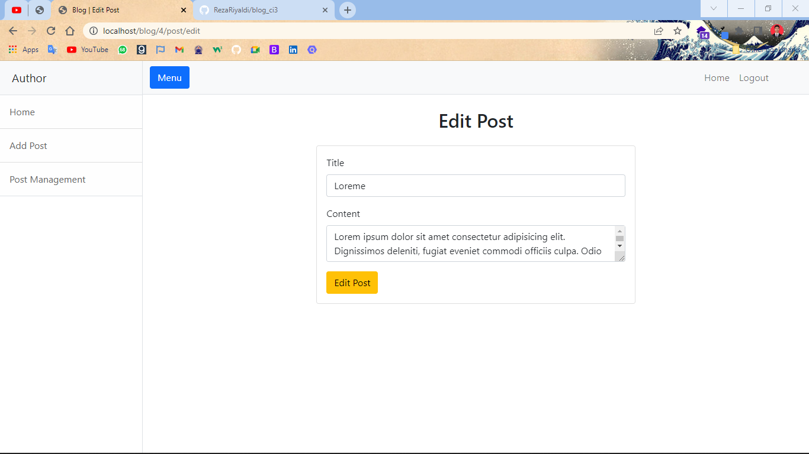

- Delete Post
> Untuk security saya menggunakan function bawa javascript untuk bertanya terlebih dahulu sebelum hapus postingan.

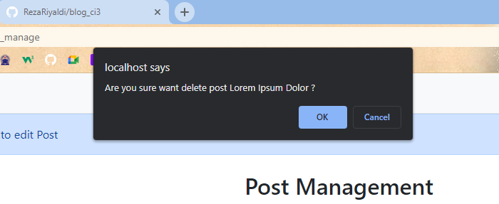
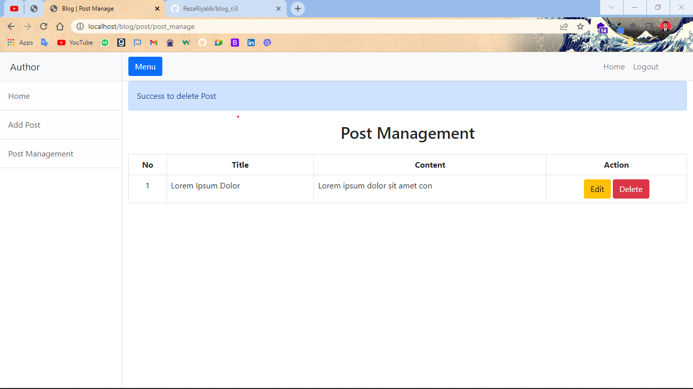

## Spesifikasi
- Codeigniter 3
- Template Simple Sidebar Bootstrap 5
